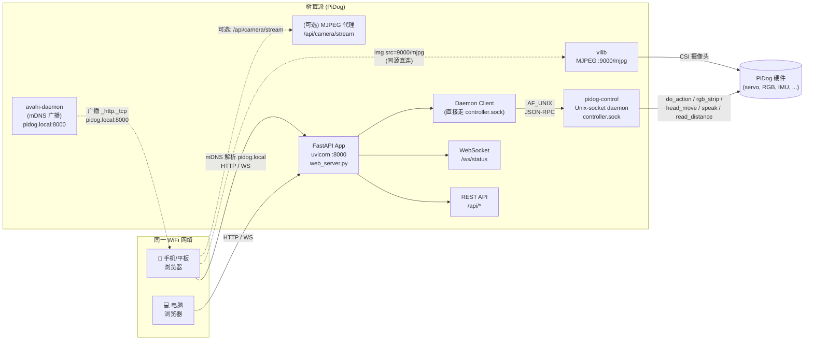
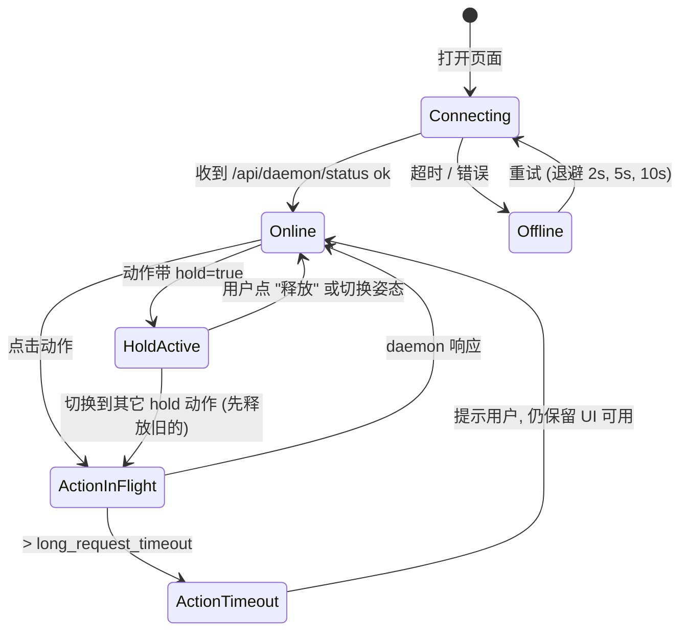

# PiDog 本地 Web 控制台 — 设计方案 (v0.3)

> 状态: **方案阶段, 未实现**
> 范围: 仅"远程/集成类 → 本地 Web 控制台"这一项
> 目标: **树莓派接上 WiFi 之后, 手机/平板/电脑用浏览器就能看画面 + 操控动作**
> 一等平台: 手机 (iOS Safari / Android Chrome) + 平板 + 桌面浏览器
> 不引入前端构建链, 视觉/演示效果优先

---

## 1. 目标与非目标

### 1.1 目标 (v1)
- **连得上**: 树莓派接上 WiFi, 树莓派自己广播 mDNS (`pidog.local`), 手机/平板/电脑浏览器打开 `http://pidog.local:8000/` 即可, 不用记 IP; 启动时打印 URL + 当前 IP (avahi 没生效时用 IP)
- **看得见**: 页面顶部是摄像头实时画面 (MJPEG), 视频与按钮在同一屏, 不需要切换
- **点得动**: 页面内置一组精选动作按钮, 点击 → 机器狗执行, 不需要打字、不需要配对 App
- **守得住**: hold 姿态、按钮防抖、舵机限位、daemon 重连, 都能兜住
- 所有硬件调用统一走 `pidog-control` 的 Unix-socket daemon, 不另起硬件进程

### 1.2 v1 精选动作集 (内置, 一屏可见)
按"演示效果 + 日常好玩"筛选, **v1 共 12 个按钮**, 分三组, 全部在 `pidog-control` daemon 已支持范围内, 不用扩展 daemon:

| 分组 | 动作 | 类型 | 备注 |
|---|---|---|---|
| 姿态 (hold) | `stand` / `sit` / `lie` | hold | 长按生效, 切到另一个会自动 release |
| 表情/动作 (一次性) | `wag-tail` / `bark` / `pant` / `stretch` / `push-up` | one-shot | 短动作, 不需 hold |
| 移动 (一次性) | `forward` / `backward` / `turn-left` / `turn-right` | one-shot | 短促走两步, 不长跑 (避免脱离视线) |

> v1.1 扩展 daemon 后, 才会加入 `scratch / hand_shake / high_five / howling / shake_head / body_twisting / doze_off` 等需要前置编排的复合动作。

### 1.3 非目标 (v1 显式不做)
- 公网暴露 (WAN / HTTPS / 反向代理) — 留到 v2
- 多用户认证、权限分级 — 留到 v2 (LAN 内信任)
- 与 HomeAssistant / MQTT / Telegram 集成 — 已在 A 方向外, 单独方案
- TTS、传感器面板、声音选择、编排拖拽 — 留到 v1.1/v1.2
- 视频录像 / 推流 / 物体检测 / 双向语音 — 用 vilib 自带能力, 不重做
- 移动端原生 App — 用浏览器即可, 页面做 PWA 风格的响应式

### 1.4 用户故事 (个人演示场景, v1 范围)
1. 把 PiDog 放地上, 树莓派连上家里 WiFi, 启动 web
2. 启动日志/终端里看到 `http://pidog.local:8000/` (avahi 没生效时退化为 IP)
3. 手机连同一 WiFi, 浏览器输入这个 URL → 进入页面 → 看到实时画面
4. 看着画面, 点 "sit" → 狗坐下; 点 "wag-tail" → 尾巴摇
5. 调色板选紫色 + "boom" → 灯条闪紫
6. 朋友来玩, 把手机/平板递过去, 各自都能控制, 互不干扰 (WebSocket 状态广播)

---

## 2. 架构总览

### 2.1 组件图



### 2.2 进程拓扑 (Pi 上的进程清单)

| 进程 | 启动方式 | 端口/套接字 | 职责 |
|---|---|---|---|
| `avahi-daemon` (新) | 系统服务 | 5353/UDP mDNS | 广播 `pidog.local` 主机名, 让手机/平板能用名字而不是 IP 访问 |
| `vilib` (相机) | 系统 / 手动 | `:9000` MJPEG | 提供视频流, 由 web/daemon 二选一启动, 不重复 |
| `pidog-control daemon` | `pidog_ctl.py start` | `~/.openclaw/pidog-control/controller.sock` | 唯一硬件入口, 串行化请求 |
| `web_server` (新) | `uvicorn` 或 `python -m web_server` | `:8000` HTTP/WS | 业务逻辑 + 静态文件 + 状态推送 + 启动时打印 URL/IP |

> 关键: web 进程**不**直接 import `pidog.Pidog`, 全部走 daemon, 避免双进程抢硬件。

---

## 3. 复用 vs 新增

### 3.1 复用现有
- ✅ `pidog-control/scripts/pidog_ctl.py` 的 `controller_request()` 客户端 — 直接 import 用
- ✅ daemon 已支持的 action/light/ping/shutdown
- ✅ `Vilib.camera_start` + `Vilib.display(local=False, web=True)` 已经在 `12_app_control.py:262-263` 跑通
- ✅ `pidog.Pidog` 的高层 API: `do_action / speak / rgb_strip.set_mode / head_move / read_distance / is_legs_done`
- ✅ `actions_dictionary` / `preset_actions` 里的全部动作名, 作为前端按钮数据源

### 3.2 需要扩展 daemon (v1.1, 见 §11 后续工作)
- `cmd=sensor` — 一次性读取 distance / IMU / 触碰
- `cmd=head` — 绝对/相对头部 RPY
- `cmd=snapshot` — 调 vilib 单帧抓图
- `cmd=say` — TTS 文本
- `cmd=sounds` — 列出 `sounds/` 下的 wav 名
- `cmd=choreo` — 编排执行
- `cmd=touch` — 订阅 dual_touch 事件
- `cmd=watch` — 进入"看门狗"模式 (被触碰/接近触发反应)

> v1 不阻塞, 先做"姿态/灯光/头部 RPY"三个明确有的; 其它作为 v1.1 增量。

---

## 4. Web 服务端设计

### 4.1 技术栈
- **Python 3.10+**, 仅依赖: `fastapi`, `uvicorn[standard]`, `pydantic`
- 不引入: 数据库 / Redis / 消息队列 (单进程 + 内存完全够用)
- 配置文件: `web_server.toml` (TOML) + 环境变量覆写

### 4.2 目录结构 (新增, 不动现有代码)

```
pidog-control/
└── web/                              ← 新建
    ├── README.md
    ├── web_server.py                 ← FastAPI 入口
    ├── daemon_client.py              ← 封装 controller_request()
    ├── status_poller.py              ← 定时 ping daemon, 给 WS 推送
    ├── mdns_register.py              ← 启动时检查 avahi, 必要时帮用户启用
    ├── routes/
    │   ├── actions.py                ← /api/action, /api/actions/list
    │   ├── lights.py                 ← /api/light, /api/lights/presets
    │   ├── status.py                 ← /api/status, /api/health
    │   └── camera.py                 ← /api/camera/snapshot (v1.1)
    ├── static/
    │   ├── index.html                ← 单页 SPA (含 viewport meta + PWA manifest link)
    │   ├── app.js                    ← Vanilla JS, < 300 行
    │   ├── style.css                 ← 暗色主题, 移动端优先
    │   ├── manifest.webmanifest      ← PWA 基础, 可 "添加到主屏幕"
    │   └── icon-192.png              ← 占位图标
    ├── web_server.toml               ← 配置
    └── systemd/
        └── pidog-web.service         ← 可选, 服务自启
```

### 4.3 配置 (`web_server.toml`)

```toml
[server]
host = "0.0.0.0"
port = 8000
log_level = "info"

[daemon]
socket = "~/.openclaw/pidog-control/controller.sock"
# 如果 daemon 没跑, 启动时是否自动拉起
auto_start = true
# 单次请求超时 (秒)
request_timeout = 5.0
# 长动作 (bark, wag) 允许更久
long_request_timeout = 15.0

[status]
# 推送给前端的轮询周期
ws_push_interval_ms = 1000

[camera]
# 直连模式: 浏览器直接拉 vilib 9000 端口
direct_mjpeg_url = "http://{host}:9000/mjpg"
# 代理模式 (可选): 通过 /api/camera/stream 中转, 适合 vilib 在不同容器/机器
proxy_enabled = false
```

### 4.4 REST API (v1)

所有响应统一:

```json
{ "ok": true,  "data": { ... } }
{ "ok": false, "error": "human readable", "code": "DAEMON_DOWN" }
```

#### 4.4.1 通用

| 方法 | 路径 | 说明 |
|---|---|---|
| GET  | `/api/health`           | 服务存活, 不碰 daemon |
| GET  | `/api/daemon/status`    | 转发 daemon 的 `cmd=ping`, 返回运行状态 |
| POST | `/api/daemon/restart`   | 重启 daemon (需 daemon 进程已被 supervise) |
| GET  | `/api/capabilities`     | 列出当前可用的 action / light / 头部限位 / 声音列表 |

#### 4.4.2 动作

| 方法 | 路径 | Body | 说明 |
|---|---|---|---|
| GET  | `/api/actions`               | — | 列出 **v1 精选 12 个** 动作 (按 §1.2 分组, 每个带 `hold` 标志 + 分组), 前端直接据此渲染按钮 |
| POST | `/api/action`                | `{ "name": "sit", "speed": 70, "hold": false }` | 触发一次动作, 不在白名单返回 `UNKNOWN_ACTION` |
| POST | `/api/action/release`        | `{ "name": "stand" }` | 释放对应 hold 进程 (仅对 hold 组生效) |
| GET  | `/api/action/:name`          | — | 查询某动作是否在 hold 中 |

**v1 动作白名单** (后端硬编码, 与 daemon 的 `ACTION_MAP` 对齐):

```
姿态 (hold=true):   stand, sit, lie
表情 (one-shot):    wag-tail, bark, pant, stretch, push-up
移动 (one-shot):    forward, backward, turn-left, turn-right
```

> v1 不扩展 daemon, 不暴露 `preset_actions` 的复合动作; v1.1 再扩。

#### 4.4.3 灯光

| 方法 | 路径 | Body | 说明 |
|---|---|---|---|
| GET  | `/api/lights/presets`  | — | 模式 + 颜色调色板, 给前端渲染按钮 |
| POST | `/api/light`          | `{ "mode": "boom", "color": "purple", "brightness": 0.8, "bps": 1.0 }` | 设置灯条 |
| POST | `/api/light/off`      | — | 快捷关灯 |

#### 4.4.4 头部

| 方法 | 路径 | Body | 说明 |
|---|---|---|---|
| GET  | `/api/head/limits`   | — | 返回 yaw/roll/pitch 的安全角度范围 (来自校准文件) |
| POST | `/api/head`          | `{ "yaw": 0, "roll": 0, "pitch": 0 }` | 绝对角度, 0/缺省表示保持 |
| POST | `/api/head/home`     | — | 头部回中 (RPY=0) |

#### 4.4.5 传感器 (v1.1)

| 方法 | 路径 | Body | 说明 |
|---|---|---|---|
| GET  | `/api/sensors`        | — | 一次性返回 distance / IMU rpy / 触摸位 / 声音方向 |
| GET  | `/api/sensors/stream` | — | SSE 推送, 周期由 `ws_push_interval_ms` 决定 |

#### 4.4.6 相机 (v1.1)

| 方法 | 路径 | Body | 说明 |
|---|---|---|---|
| GET  | `/api/camera/snapshot` | — | 单帧 JPEG, `Content-Type: image/jpeg` |
| GET  | `/api/camera/stream`   | — | 代理 vilib MJPEG (当 `proxy_enabled=true`) |

### 4.5 WebSocket 协议

单一端点: `ws://<host>/ws/status`

**客户端 → 服务端**:
- `{ "op": "subscribe", "topics": ["posture", "sensors", "light"] }`
- `{ "op": "ping" }`

**服务端 → 客户端** (由 status_poller 触发):
```json
{
  "ts": 1734567890.12,
  "posture": "sit",
  "running": true,
  "uptime_s": 123.4,
  "last_action": { "name": "wag-tail", "speed": 100, "hold": false }
}
```

> v1.1 增加 `sensors` / `light` / `imu` 字段, 同样由 poller 周期性合并推送。

### 4.6 状态机 (前端 SPA 状态)



---

## 5. 守护进程 (web) 的并发模型

```
                  ┌─────────────────────────────────────────┐
                  │              uvicorn (asyncio)          │
                  │                                         │
  HTTP/WS 请求 ──▶│  FastAPI handlers (async)               │
                  │     │                                   │
                  │     └─▶ daemon_client.request(payload)  │  ← 同步调用, 走线程池
                  │              │                          │
                  └──────────────┼──────────────────────────┘
                                 ▼
                  ┌─────────────────────────────────────────┐
                  │  daemon_client (sync, 线程池 offload)   │
                  │     │                                   │
                  │     └─▶ controller_request()            │  ← socket.send + recv
                  │              │                          │
                  └──────────────┼──────────────────────────┘
                                 ▼
                  controller.sock (AF_UNIX, SOCK_STREAM)
                                 │
                  ┌──────────────▼──────────────────────────┐
                  │  pidog-control daemon (同步, 单线程)    │
                  │     PiDogController.handle(req)         │
                  │     (请求串行化)                        │
                  └─────────────────────────────────────────┘
```

要点:
- FastAPI handler 全部 `async def`, 但 `controller_request()` 是阻塞 IO, 用 `asyncio.to_thread()` 派到默认线程池
- 线程池默认 40 线程足够 (v1 实际上只会有 1-2 个并发请求, 因为前端按钮会 throttle)
- daemon 本身是单线程 `accept + handle`, **天然串行**, 不会和 `companion` / `12_app_control` 抢硬件 (但要避免和它们**同时**运行, 启动 web 前要 stop 这些)
- `status_poller` 是独立 asyncio task, 每 `ws_push_interval_ms` 跑一次, 把结果 fan-out 给所有 WS 客户端

---

## 6. 错误处理 & 安全护栏

### 6.1 错误码设计

| code | 含义 | 前端处理 |
|---|---|---|
| `DAEMON_DOWN`        | socket 不通 / daemon 死 | 顶部红色 banner + 自动重试 |
| `DAEMON_BUSY`        | daemon 在处理上一个长动作 | 按钮置灰 200ms, 队列计数提示 |
| `UNKNOWN_ACTION`     | 动作名不在 capability 列表 | 按钮被前端过滤掉, 后端做兜底 |
| `CALIBRATION_NEEDED` | 校准文件缺失 | 引导用户跑 `examples/0_calibration.py` |
| `RUNTIME_UNAVAILABLE`| `from pidog import Pidog` 失败 | 引导用户检查 `pip3 install` |
| `INVALID_HEAD_ANGLE` | pitch/yaw 超过限制 | 滑块硬件 clamp + 后端再校验 |
| `TIMEOUT`            | 超过 request_timeout       | 提示并保留 UI 可用 |

### 6.2 软硬件护栏
- 所有 `do_action` / `head_move` 在前端按钮按下时**先 disable 200ms**, 避免双击
- hold 切换: 切换前自动 `release` 上一个 hold 进程 (复用 `pidog-control.stop_previous_hold`)
- 头部角度: 前后端双重 clamp, 取校准文件的 min/max
- TTS 文本长度限制 (例如 200 字), 超长截断 + 警告
- 视频: `` 加载失败时显示 "视频不可用", 不影响其它功能
- 启动前 sanity check: 调 `status` 失败, 提示 "daemon 没跑, 是否自动启动?"

### 6.3 网络/认证 (v1)
- 仅监听 LAN; 不暴露 WAN
- v1 不做认证, **假设只有受信任的家庭/办公网**
- 留 `auth_token` 配置项位置 (v2 启用); 启用后所有 `/api/*` 与 `/ws/*` 需要 `Authorization: Bearer <token>` 或 `?token=...`

---

## 7. 前端布局 (单页, 移动端优先)

### 7.1 移动端 (竖屏, 默认) — 一屏搞定

```
┌──────────────────────────────────────┐
│  🐶 PiDog    [● 在线]      [⏻]      │  ← 顶栏 (粘性)
├──────────────────────────────────────┤
│                                      │
│         实时视频                     │  ←  16:9
│        (MJPEG 9000/mjpg)             │     触摸双击可全屏
│                                      │
├──────────────────────────────────────┤
│  姿态 (按一下保持)                    │
│  [ Stand ] [ Sit ] [ Lie ]           │  ← 3 列, 大按钮 ≥ 48px
├──────────────────────────────────────┤
│  表情 / 动作                          │
│  [ Wag ]  [ Bark ] [ Pant ]          │  ← 2~3 列网格
│  [Stretch] [Push-up]                 │
├──────────────────────────────────────┤
│  移动 (短促)                          │
│  [ ←左转 ] [前进]  [右转 →]           │  ← 中间是前进
│  [        后退        ]              │
├──────────────────────────────────────┤
│  灯光:  [ 关 ] [ 呼吸 ] [ 监听 ] [ Boom ] │
│  颜色:  ●●●●●●●●●         亮度: ●─○    │
├──────────────────────────────────────┤
│  [ 停所有动作 ]                       │  ← 兜底
└──────────────────────────────────────┘
```

### 7.2 桌面 / 横屏 — 视频 + 控件并排

```
┌────────────────────────────────────────────────────────────┐
│  🐶 PiDog    [● 在线]   [停所有动作]  [重启 daemon]  [⏻]   │
├──────────────────────────────┬─────────────────────────────┤
│                              │  姿态: [Stand][Sit][Lie]    │
│                              │  ─── 动作 ───               │
│         实时视频              │  [Wag][Bark][Pant]          │
│        (16:9 MJPEG)          │  [Stretch][Push-up]         │
│                              │  ─── 移动 ───               │
│                              │  [←左转][前进][右转→]        │
│                              │  [      后退      ]         │
│                              │  ─── 灯光 ───               │
│                              │  模式/颜色/亮度              │
└──────────────────────────────┴─────────────────────────────┘
```

### 7.3 移动端硬性要求 (v1 必达)

- **viewport meta**: `<meta name="viewport" content="width=device-width, initial-scale=1, viewport-fit=cover, user-scalable=no">`
- **iOS Safari 防缩放坑**: 所有 `<input>` / `<select>` 的 `font-size: 16px+`, 否则点输入框会触发 iOS 放大
- **触摸目标**: 所有可点元素 ≥ 44×44 px (Apple HIG), 按钮间距 ≥ 8 px
- **safe-area**: 用 `env(safe-area-inset-*)` 兼容刘海屏/iPad 圆角
- **滑动手势**: 头部 RPY 滑块在手机上用横滑手势, 桌面用鼠标拖 (v1.1, 暂用 `<input type="range">`)
- **横竖屏切换**: 视频保持 `object-fit: contain`, 不裁切
- **低带宽省流**: MJPEG 默认就是连续帧, v1 不做动态降帧, 但 `` + 失败回退到 "视频不可用" 占位
- **PWA 基础**: `manifest.webmanifest` 让用户能 "添加到主屏幕", 全屏启动, 像 App 一样
- **暗色主题**: 跟随系统 `prefers-color-scheme`, 默认深色
- **顶栏粘性**: `position: sticky; top: 0`, 滚动不丢状态
- **Online/Offline 心跳**: WS 断 5s 后红色 banner, 重连后绿色
- **触摸反馈**: `:active` 状态有背景色变化 + `transform: scale(0.98)`, 50ms 回归

### 7.4 启动时的发现体验 (v1 必达)

- **终端打印** (二维码已砍掉, 走"手动输 URL"路线):
  ```
  [pidog-web] started at http://0.0.0.0:8000
  [pidog-web] LAN 访问:   http://pidog.local:8000/
  [pidog-web] 当前 IP:   http://192.168.x.x:8000/   (avahi 未生效时使用)
  [pidog-web] 第一次用:  把上面 URL 发到手机浏览器 (手机需在同一 WiFi)
  ```
- 不再引入二维码相关依赖, 不生成终端/页面二维码, 砍掉"分享给手机"弹窗
- **页面内**: 顶栏常驻显示当前 URL (点击复制), 方便从电脑切到手机

---

## 8. 部署

### 8.1 手动启动 (开发)

```bash
# 0) 一次性安装系统依赖 (mDNS 让手机能用 pidog.local 访问)
sudo apt install avahi-daemon
sudo systemctl enable --now avahi-daemon

# 1) 一次性安装 web 依赖
pip3 install 'fastapi>=0.110' 'uvicorn[standard]>=0.27' pydantic

# 2) 启动 daemon (如果没在跑)
python3 ~/pidog/pidog-control/scripts/pidog_ctl.py start

# 3) 启动 web (前台, 看日志)
python3 ~/pidog/pidog-control/web/web_server.py

# 4) 终端会打印:
#    http://pidog.local:8000/   +   兜底 IP
#    把这条 URL 发到手机/平板/电脑浏览器即可 (需在同一 WiFi)
```

### 8.2 systemd (生产)

`pidog-web.service` (放 `pidog-control/web/systemd/`):

```
[Unit]
Description=PiDog Local Web Console
After=network-online.target
Wants=network-online.target

[Service]
Type=simple
User=pidog
WorkingDirectory=/home/pidog/pidog/pidog-control/web
ExecStart=/usr/bin/python3 web_server.py
Restart=on-failure
RestartSec=3
Environment=PYTHONUNBUFFERED=1

[Install]
WantedBy=multi-user.target
```

daemon 端建议也加一个 `pidog-daemon.service`, 顺序:
`pidog-daemon.service` 先于 `pidog-web.service`, 后者 `Wants=` 前者。

### 8.3 启动检查清单 (启动脚本内置)

1. `python3 -c "import pidog"` — 通过则继续, 否则退出 + 提示装 pidog
2. 检查 `~/.config/pidog/pidog.conf` 是否存在 — 缺则提示跑校准
3. 检查 avahi-daemon 是否在跑 — 不在则提示 `sudo apt install avahi-daemon && sudo systemctl enable --now avahi-daemon`, 但不强制阻断 (IP 访问仍可用)
4. 检查 vilib 是否在 `:9000` 提供 MJPEG — 不在则尝试 `Vilib.camera_start + display(web=True)`, 再失败则提示手动启动
5. 检查 daemon socket — 不在则 `pidog_ctl.py start`
6. uvicorn 启动, 监听 `:8000`
7. 打印 `http://pidog.local:8000/` + 当前 IP (兜底, avahi 未生效时使用)

---

## 9. 安全模型 (v1)

| 威胁 | 措施 |
|---|---|
| 陌生人 LAN 内访问 | v1 接受此风险, 文档里写明 "仅在受信任网络使用" |
| 浏览器被 CSRF | v1 同源, 无 cookie, 风险低 |
| 大体积 TTS 把喇叭打爆 | 服务端限制 200 字 + 拒绝非 ASCII 控制字符 |
| 前端按钮 spam 把舵机打坏 | 按钮 throttle 200ms + hold 切换时强制 release |
| daemon 进程被 kill | web 前端 5s 内发现 → 红色 banner + 自动 `pidog_ctl.py start` 重启一次 (限 3 次/小时, 超过放弃) |
| 视频流被恶意嵌入 | 同源限制, 外部域名无法 iframe (CSP `frame-ancestors 'self'`) |

---

## 10. 测试 & 验收

### 10.1 单元/集成测试 (v1.1 加, v1 阶段手动)

| 场景 | 期望 |
|---|---|
| 启动后 1s 内 `/api/health` 返回 200 | ✓ |
| 点 "Stand" → 狗站起 → 日志显示 `action 'stand' dispatched` | ✓ |
| 同时点 "Stand" 和 "Sit" | 第二个排队 200ms, 之后只执行 sit |
| hold 切换 stand → sit | 前一个 hold 进程自动 SIGTERM |
| daemon 被 `kill -9` | 5s 内 UI 变红, 自动重启一次 |
| 浏览器断网 10s | UI 显示离线, 重连后回到 Online |
| 手机 4G (非同网) | 直接连不上, 提示用户需在同一 WiFi |
| vilib 没启动 | 视频区显示占位, 其它功能仍可用 |
| 手机浏览器开 `http://pidog.local:8000/` | 解析成功, 进入页面 (前提: avahi 已起) |
| 手机竖屏 / 横屏切换 | 视频和控件正常重排, 不破版 |
| iOS Safari 点任何按钮 | 不触发页面缩放 |
| 平板 (iPad) 打开 | 横屏显示桌面布局, 竖屏显示手机布局 |

### 10.2 真机验收 (你来做)
- [ ] PC Chrome 打开 → 全功能 ok
- [ ] iPhone Safari 打开 → 触摸流畅, 视频不卡, 按钮不误触
- [ ] Android Chrome 打开 → 同上
- [ ] iPad 横屏 → 看到桌面双列布局
- [ ] Android 平板 → 同上
- [ ] 杀 daemon → UI 5s 内变红, 自动恢复
- [ ] 同时跑 `examples/12_app_control.py` — 任一进程控制时另一个动作被串行化等待, 视频不串
- [ ] 拔网线/重连 WiFi → avahi 几秒内重新广播, 手机无需重启浏览器即可访问
- [ ] 灯光控件: 切换 4 种模式 + 改色 + 改亮度, 灯条反应正确

---

## 11. 后续工作 (v1.1+)

| 版本 | 内容 |
|---|---|
| v1.0 | mDNS (`pidog.local`) + PWA 基础 + 12 个精选动作 + 灯光/亮度 + 视频直连 + 健康检查 + WS 状态 + 手机/平板/桌面三端响应式 |
| v1.1 | daemon 扩展 (`cmd=sensor / snapshot / say / sounds / choreo`); 前端补传感器面板、TTS、声音选择、复合动作 (stretch / push-up / scratch / hand_shake / high_five / howling) |
| v1.2 | SSE 传感器流, watch 模式 (被动反应), 编排 UI 拖拽, 头部 RPY 触屏手势 |
| v2.0 | 鉴权 (token), HTTPS (Caddy 反代), 公网端口, 鉴权后再放开 mDNS 之外的服务 |
| v2.1 | 与 companion 编排器联动, 触发对话式反馈 |
| v2.2 | 多客户端 (WebRTC 双向音视频, 走 vilib + 浏览器麦克风) |

---

## 12. 风险 & 决策记录

| # | 风险 / 决策 | 处理 |
|---|---|---|
| D1 | web 进程和 companion 同时跑会抢硬件 | 文档写明 "启动 web 前先 stop companion 例程" |
| D2 | vilib 视频和 web 不在同一进程, 跨网段时直连失败 | 留 `proxy_enabled` 配置项做兜底 |
| D3 | FastAPI 引入新依赖, Pi Zero 2 W 内存紧 | 文档建议 Pi 3B+ 跑; Pi Zero 需要砍 `uvicorn[standard]` 到裸 `uvicorn` |
| D4 | 没前端构建链, 单文件 HTML 写复杂状态会乱 | 用 vanilla JS + 显式 `state` 对象, 不引框架; 超过 500 行再考虑 |
| D5 | WebSocket 心跳 vs SSE | 选 WS, 因为后续要支持反向控制消息 (v1.1+) |
| D6 | 用相对路径 vs 硬编码 `pidog-control/scripts/pidog_ctl.py` 路径 | 走 `from pidog_control.web.daemon_client import ...` 风格, 把整个 `pidog-control` 装成可导入包; v1 阶段允许 `subprocess` 调 CLI |
| D7 | iOS Safari 对 `<input>` 自动缩放, 误触体验差 | 强制 `font-size: 16px`, 锁 viewport `user-scalable=no` |
| D8 | iOS Safari 不支持内联视频自动播放/全屏 API 限制 | 用 `` 跑 MJPEG 而非 `<video>`, 避开 iOS 视频策略 |
| D9 | 局域网有其它 `pidog` 主机名冲突 | mDNS 主机名加末位随机后缀, 启动时探测冲突, 改用 `pidog-<hash>.local` |
| D10 | 手机锁屏/切后台导致 WS 断 | 浏览器进入后台, WS 自然断, 切回时由前端重连; 不强求后台保活 (会耗电) |
| D11 | 路由器/交换机隔离客户端 (AP isolation) | 文档提示: 家庭 WiFi 通常 OK, 公共/企业 WiFi 经常隔离, 这种情况改用手机开热点给 PiDog |

---

## 13. v0.3 收尾 + 残余开放问题

### 13.1 已按你最新要求确定下来的
- ✅ 连接方式: **WiFi 局域网**, 树莓派自己起 mDNS (`pidog.local`), 手动输 URL 连 (无二维码)
- ✅ 平台: **手机/平板/电脑三端响应式**, 移动端竖屏是一等设计目标
- ✅ 摄像头: **MJPEG 直连** vilib 9000 端口, 内嵌在页面
- ✅ 控制: **12 个精选动作按钮** (姿态 hold + 表情 + 移动), 一屏可见
- ✅ **灯光/亮度控件保留** (模式 off/breath/listen/boom + 颜色调色板 + 亮度滑块)
- ✅ 不引入前端构建链, PWA 风格 (可加桌面图标)
- ✅ 不引入 `qrcode` 依赖, 不打印/绘制二维码

### 13.2 还需要你拍板
1. **mDNS 主机名**: 用 `pidog.local` / `pidog` / 你想用的名字? (我默认 `pidog.local`)
2. **是否需要"停所有动作"兜底按钮**? 我倾向保留, 误操作时一键恢复
3. **动作集 12 个的颗粒度**: 我选了 stand/sit/lie + wag/bark/pant/stretch/push-up + forward/backward/turn-left/turn-right; 你是想加/减/换某些?
4. **灯光模式范围**: v1 用 `off / breath / listen / boom` 四种, 是够用还是要加/减?

确认完上面 4 个, 我就可以出实现计划 + 接口签名定稿, 之后你点头我再开始写代码。
